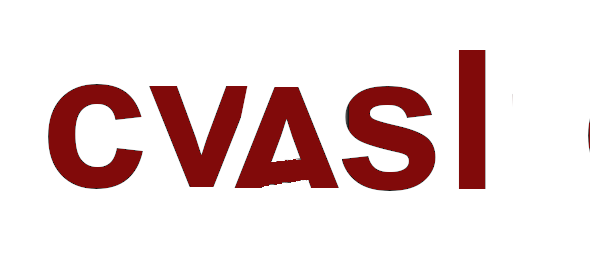

<p align="center">
    
</p>

[
[](https://pypi.python.org/pypi/cvasl/)
[](https://anaconda.org/resurfemg/resurfemg)
[](https://github.com/brainspinner/cvasl/actions/workflows/on-commit.yml)
[](https://github.com/brainspinner/cvasl/actions/workflows/on-tag.yml)

**cvasl** is an open source collaborative python library for analysis
of brain MRIs. Many functions relate to arterial spin labeled sequences.


This library
supports the ongoing research at University of Amsterdam Medical Center on brain ageing, but
is being buit for the entire community of radiology researchers across all university and academic medical centers and beyond.


### Program files

The main program in this repository (made of the modules in the cvasl folder) contains functions for analysis of MRIs.

### Folders and Notebooks

To look around keep in mind the following distinction on folders:

researcher_interface:
- This folder will be added in the future for
  a growing series of interactive notebooks that allow
  researchers to investigate questions about their own MRI data
 
open_work:
- This folder contains experimental work by core members of the cvasl
  team (including Dr. Candace Makeda Moore, Dr. Dani Bodor, Dr. Henk Mutsaerts)

harmonization_paper:
- This folder contains experimental work for a forthcoming paper by core members of the cvasl
  team (including Dr. Candace Makeda Moore, Dr. Dani Bodor, Dr. Henk Mutsaerts,
  and Mathijs Dijsselhof) which deals with radiological image harmonization.

lab_datasets:
- This folder contains notebooks which show how image datasets were assembled in notebooks.

Please keep in mind that at present you will only be able to scroll images
in the notebooks with a browser based approach i.e. run Jupyter in a browser but
not in VSCode or another IDE to scroll the brain MRIs. 


### Data sets

The notebooks are configured to run on various datasets.  Contact
Dr. Candace Makeda Moore( 📫 c.moore@esciencecenter.nl) to discuss any
questions on data configuration for your datasets. In terms of 
derived value datasets (which use measurements instead of images)
You will need tsv and/or csv file 
datasets arranged in a particular format as specified in
[seperated_values_specifications.md](seperated_values_specifications.md)


### Configuring (to work with your data)

In order to preprocess and/or to train  models the code needs to be
able to locate the raw data you want it to work with.

There are several ways to specify the location of the following
directories:

-   **bids:** Special directory.  The rest of the directory layout can
    be derived from its location.

You can store this information persistently in several locations.

1.  In the same directory where you run the script (or the notebook).
    e.g. `./config.json`.
2.  In home directory, e.g. `~/.cvasl/config.json`.
3.  In global directory, e.g. `/etc/cvasl/config.json`.

However, we highly recommend you use the home directory.
This file can have this or similar contents:

    {
 
        "bids": "/mnt/source_data",
        "raw_data": "/mnt/source_data/raw_data",
        "derivatives": "/mnt/source_data/derivates/",
        "explore_asl": "/mnt/source_data/derivates/explore_asl",
        "cvage": "/mnt/source_data/derivates/cvage",
        "cvage_inputs": "/mnt/source_data/derivates/cvage/cvage_inputs",
        "cvage_outputs": "/mnt/source_data/derivates/cvage/cvage_outputs",

    }

The file is read as follows: if the file only specifies `bids`
directory, then the derivative missing entries are assumed to be
relative to the root in a BIDS compliant format order You don't need
to specify all entries.  If you do, you can overwrite the ALS-BIDS
format order but this is not reccomended.

When working from command line, it may be useful to experiment with
different directory layouts or to quickly override the existing
options.  To do so, you can invoke the program like this:

```sh
python -m cvasl -C raw_data:/path/to/data <other options>
```

The snippet above allows using existing `config.json` but overrides
the location of `raw_data` directory.

```sh
python -m cvasl -C bids:/path/to/data -n <other options>
```

The snippet above ignores any existing `config.json` files and sets
the BIDS directory to `/path/to/data` (the rest will be derived from
it).

```sh
python -m cvasl \
    -C raw_data:/path/to/data \
    -C derivatives:/path/to/derivatives \
    -c /custom/config/location \
    <other options>
```

The snippet above looks for configuration file in the alternative
location: `/custom/config/location` while overriding the locations of
`raw_data` aand of `derivatives` directories.

If you aren't sure where the data would be read or stored, you can run:

```sh
python -m cvasl <some options> dump_config
```

The above will print the effective configuration that will be used by
the program.

### Test data

You can get test data by contacting the cvage team. Please email Dr. Moore at c.moore@esciencecenter.nl


## Getting started


How to get the notebooks running?  Assuming the raw data set and
metadata is available.

0. Assuming you are using conda for package management:    
  * Make sure you are in no environment:

      ```sh
      conda deactivate
      ```

      _(optional repeat if you are in the base environment)_

      You should be in no environment or the base environment now


1. 
  Option A: Fastest option:
  In a base-like environment with mamba installed, you can install all Python packages required, using `mamba` and the `environment.yml` file. 

  If you do not have mamba installed you can follow instructions (here)[https://anaconda.org/conda-forge/mamba]
  


   * The command for Windows/Anaconda/Mamba users can be something like:

     ```sh
     mamba env create -f environment.yml
     ```


  Option B: To work with the most current versions with the possibility for development:
  Install all Python packages required, using `conda` and the `environment.yml` file. 


   * The command for Windows/Anaconda users can be something like:

     ```sh
     conda env create -f environment.yml
     ```

     Currently, you will then need to clone the repository to run the cvasl from repo. 
     We will soon have an option to create the entire environment at once from conda.

    Option C:
    * Linux users can create their own environment by hand (use
      install_dev as in setup).
2. If you want to work with command-line, you can do so in your terminal, but 
  if you would like to run our pre-made notebooks, then you can start them by entering
  `jupyter lab` into the terminal


### Testing

The project doesn't include testing data yet.  

### Command-Line Interface
You will eventually be be able to preprocess, train and use models, and perform other functions using command-line interface. As of now (April 2023) this module is still being built.

Below is an example of how to look at the help for that in general:
`python -m cvasl --help` 

And here is an example for a specific function:
`python -m cvasl hash_over --help`

And here are examples of a working commands (file names can be changed):
to hash over files:
`python -m cvasl hash_over --extension tsv  --input test_data --output some_ignored_folder`

to run a debiasing algorithm over files:
`python -m cvasl debias_over --preprocessing N4_debias_sitk --input test_data --output ignrd_flder `


All long options have short aliases.


✨Copyright 2023 Netherlands eScience Center and U. Amsterdam Medical Center
Licensed under <TBA> See LICENSE for details.✨
